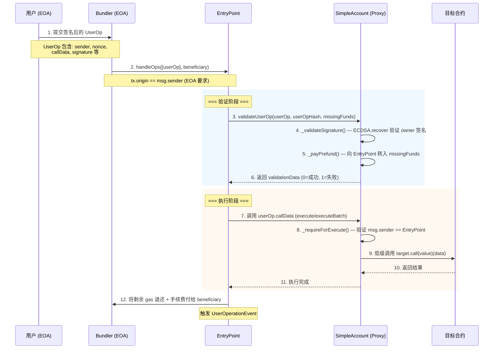
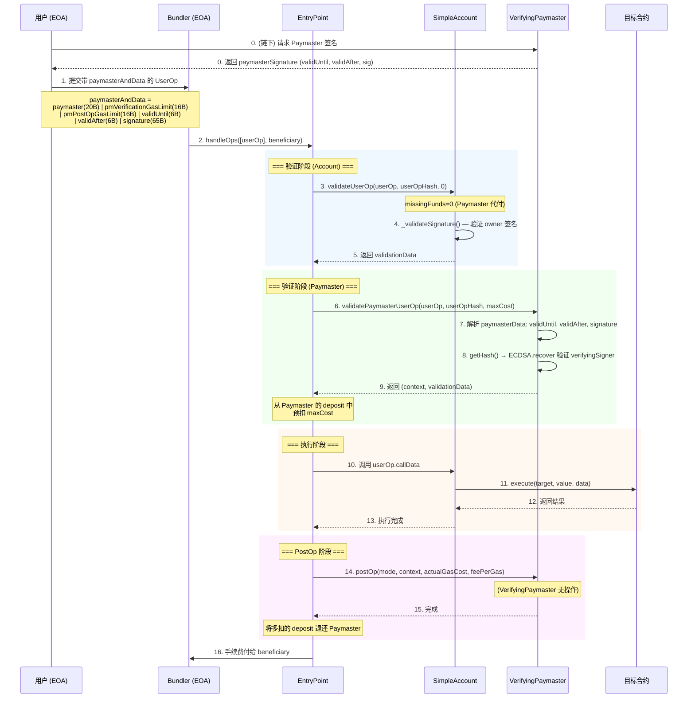
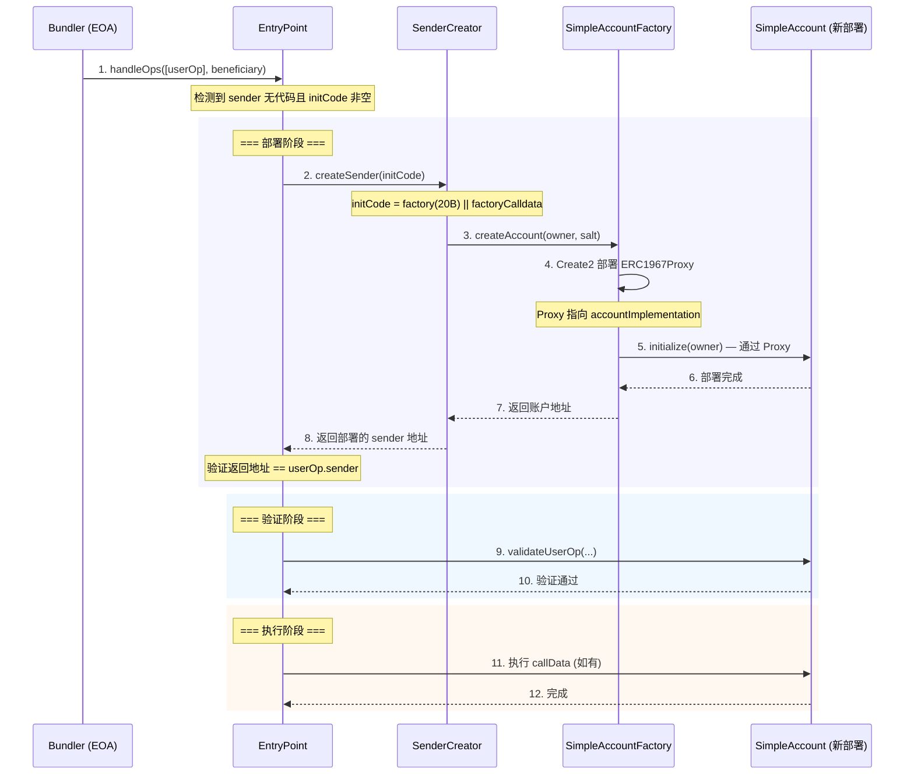
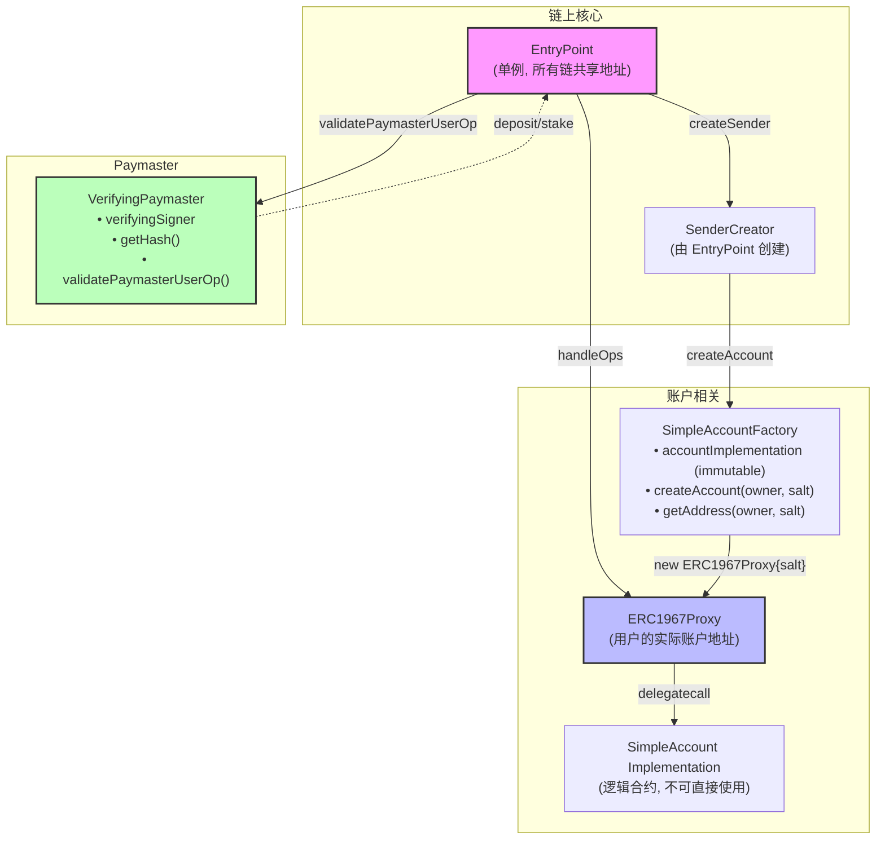

# ERC-4337 交易调用流程

## 1. 基础交易流程（账户自付 Gas）



## 2. 带 Paymaster 的交易流程（Gas 代付）



## 3. 首次部署账户的交易流程（含 initCode）



## 4. 合约架构关系



## 5. 数据编码格式

```
┌─────────────────────────────────────────────────────────────────┐
│                     PackedUserOperation                         │
├──────────────────┬──────────────────────────────────────────────┤
│ sender           │ 账户合约地址 (20 bytes)                       │
│ nonce            │ uint192(key) || uint64(sequence)             │
│ initCode         │ factory(20B) || factoryCalldata (首次部署时)  │
│ callData         │ execute(target,value,data) 的 ABI 编码       │
│ accountGasLimits │ verificationGasLimit(16B) || callGasLimit(16B)│
│ preVerificationGas│ 预验证 gas                                  │
│ gasFees          │ maxPriorityFee(16B) || maxFeePerGas(16B)     │
│ paymasterAndData │ 见下方详细格式                                │
│ signature        │ owner 对 userOpHash 的 ECDSA 签名 (65B)      │
└──────────────────┴──────────────────────────────────────────────┘

paymasterAndData 编码:
┌────────────┬────────────────────┬───────────────┬──────────────────┐
│ paymaster  │ pmVerificationGas  │ pmPostOpGas   │ paymasterData    │
│ (20 bytes) │ (16 bytes)         │ (16 bytes)    │ (动态长度)        │
└────────────┴────────────────────┴───────────────┴──────────────────┘
                                                   │
                                    ┌──────────────┴──────────────┐
                                    │ validUntil(6B) |            │
                                    │ validAfter(6B) |            │
                                    │ signature(65B)              │
                                    └─────────────────────────────┘
```
